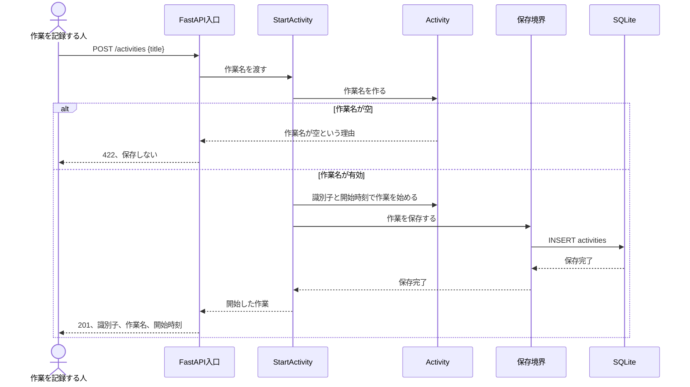

# SC-001 作業を始めるシーケンス

対応する体験: [SC-001 作業を始める](../../110_requirements/シナリオ/SC-001-作業を始める.md)

```mermaid
sequenceDiagram
    actor User as 作業を記録する人
    participant HTTP as FastAPI入口
    participant Usecase as StartActivity
    participant Domain as Activity
    participant Repository as 保存境界
    participant SQLite

    User->>HTTP: POST /activities {title}
    HTTP->>Usecase: 作業名を渡す
    Usecase->>Domain: 作業名を作る
    alt 作業名が空
        Domain-->>HTTP: 作業名が空という理由
        HTTP-->>User: 422、保存しない
    else 作業名が有効
        Usecase->>Domain: 識別子と開始時刻で作業を始める
        Usecase->>Repository: 作業を保存する
        Repository->>SQLite: INSERT activities
        SQLite-->>Repository: 保存完了
        Repository-->>Usecase: 保存完了
        Usecase-->>HTTP: 開始した作業
        HTTP-->>User: 201、識別子、作業名、開始時刻
    end
```

作業名の規則はDomain、作業開始の順序はUsecase、HTTP状態への変換はFastAPI入口、永続化はSQLAlchemyの保存実装が受け持ちます。保存が完了する前に201を返しません。
