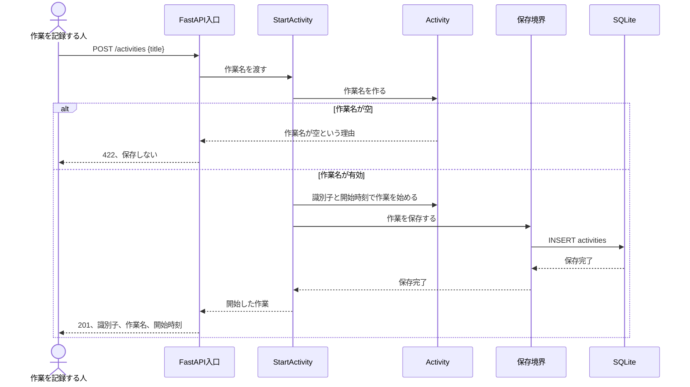
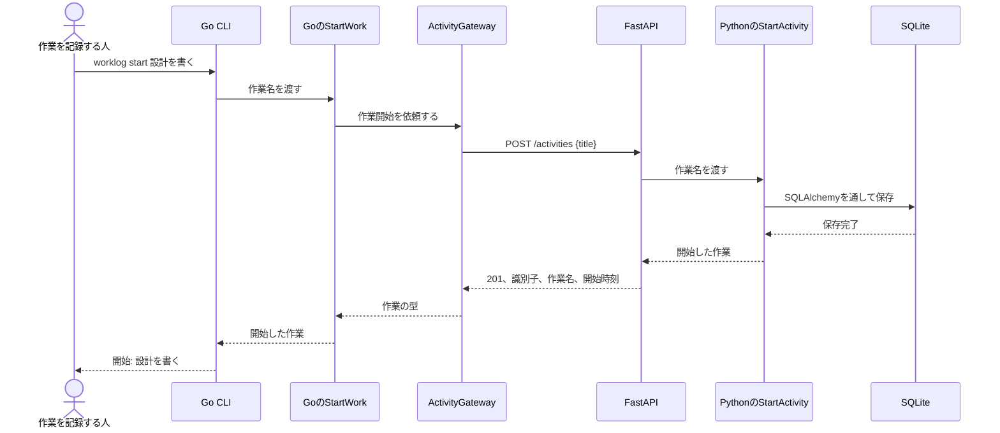

# SC-001 作業を始めるシーケンス

対応する体験: [SC-001 作業を始める](../../110_requirements/シナリオ/SC-001-作業を始める/README.md)

## HTTPから始める

作業名の規則はDomain、作業開始の順序はUsecase、HTTP状態への変換はFastAPI入口、永続化はSQLAlchemyの保存実装が受け持ちます。保存が完了する前に201を返しません。

## Go CLIから始める

GoクライアントはPythonの型とSQLiteを知りません。`contracts/worklog-api.openapi.json` に公開した要求と応答だけを境にします。通信または契約の読み取りに失敗した場合、CLIは開始したと表示しません。

要求を送った後に応答だけ失われた場合、CLIからは保存の有無を確定できません。現在は結果不明として失敗を返し、自動再試行しません。再試行しても二重登録しない仕組みは、識別子または結果照会を扱う後続のシナリオと増分で決めます。
