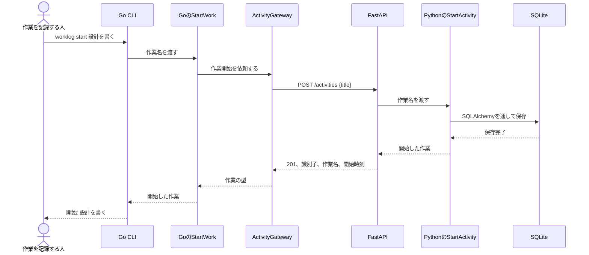

# SC-002 別のクライアントから作業を始めるシーケンス

対応する体験: [SC-002 別のクライアントから作業を始める](../../110_requirements/シナリオ/SC-002-別のクライアントから作業を始める.md)

GoクライアントはPythonの型とSQLiteを知りません。`contracts/worklog-api.openapi.json` に公開した要求と応答だけを境にします。通信または契約の読み取りに失敗した場合、CLIは開始したと表示しません。
