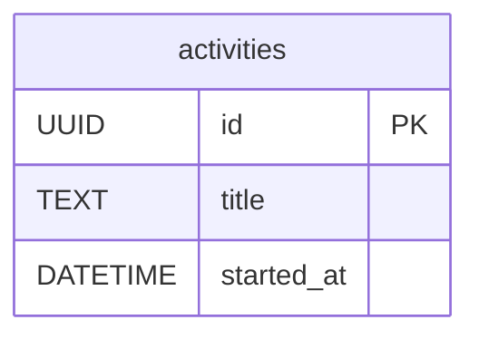

# データの構造

> 作業記録アプリのサンプルです。新しい製品では、最初のIssueへ着手する前に図と説明を削除し、保存する実体、関係、所有、変わらない規則へ書き直してください。

## 保存する実体

| 実体 | 持つもの | 所有する単位 |
|---|---|---|
| 作業 | 識別子、前後の空白を除いた作業名、UTCの開始時刻 | `backend/worklog-api` |

作業は一度始めると、識別子、作業名、開始時刻を同じ一件として保存します。作業名は空にできません。識別子は作業ごとに一意です。開始時刻は時差付きの瞬間として扱います。

Goクライアントはこの保存形式を知りません。公開HTTP契約にある識別子、作業名、開始時刻だけを受け取り、自分の作業の型へ復元します。SQLiteの表やSQLAlchemyのモデルが変わっても、公開契約が同じならクライアントは変えません。

## 保存しない値

表示文 `開始: <作業名>` は保存しません。Goクライアントが応答の作業名から作ります。作業時間、終了状態、利用者、端末も現在のシナリオと要求に無いため保存しません。

## 変更するとき

列、関係、所有する単位、不変条件を変える増分では、この文書と対応するシナリオ、要求、受入例、公開契約を同じPull Requestで更新します。保存済みデータの意味や移行が変わる場合は、戻す費用が高いため決定記録も作ります。
