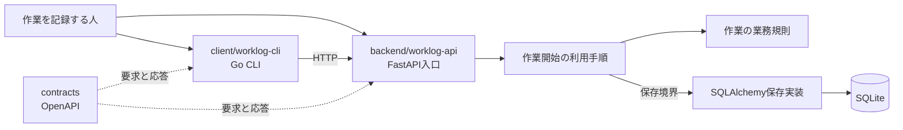

# 全体構造

> 作業記録アプリのサンプルです。新しい製品では、最初のIssueへ着手する前に図と説明を削除し、実際に動かす単位と責任へ書き直してください。

## 動かす単位と依存

## 責任

| 単位 | 責任 |
|---|---|
| `client/worklog-cli` | 人が打った命令を読み、公開契約でバックエンドへ依頼し、結果を表示する |
| `contracts` | バックエンドとクライアントが共有するHTTPの要求と応答を公開する |
| `backend/worklog-api` | HTTPを受け、業務の規則を通して作業を保存する |
| SQLite | バックエンドが所有する作業の現在値を保存する |

バックエンドとクライアントは別々に配備・配布でき、相手の内部コードを読み込みません。作業の保存先は `worklog-api` だけが所有します。CLIはSQLiteを直接読みません。

## 内側の依存

バックエンドでは、FastAPIとSQLAlchemyから、利用の手順、業務の規則へ依存を向けます。`ApplicationFactory` がデータベース、保存実装、利用手順、HTTP入口を一か所で組み立てます。業務の規則はFastAPI、SQLAlchemy、SQLiteを知りません。

クライアントでは、CLIとHTTP通信から、作業開始の利用手順と作業の型へ依存を向けます。バックエンドとの通信は `ActivityGateway` が受け持ちます。

## 現在ないもの

Webとモバイルのクライアント、認証、作業の一覧・終了・修正、複数端末の同期はありません。これらは対応するシナリオと受入基準を追加する増分まで作りません。
